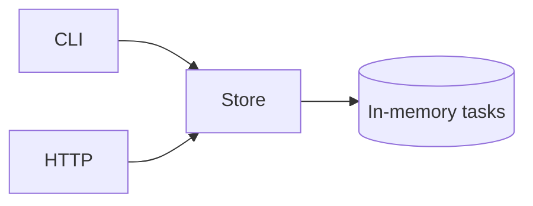

# Sample Task Service

This repository is a stable fixture for testing pull request review tools. It contains a small Go service and intentionally varied pull requests.

## Run

```sh
go test ./...
go run ./cmd/sample
```

## API

`GET /tasks` returns the current tasks. `POST /tasks` creates a task from a JSON body containing a non-empty `title`.

## Fixture rules

- `main` must stay green.
- Pull requests may intentionally fail checks or contain merge conflicts.
- Scenario branches are fixtures. Do not merge or update them unless the scenario calls for it.
- PR descriptions explain whether an oddity is intentional.


